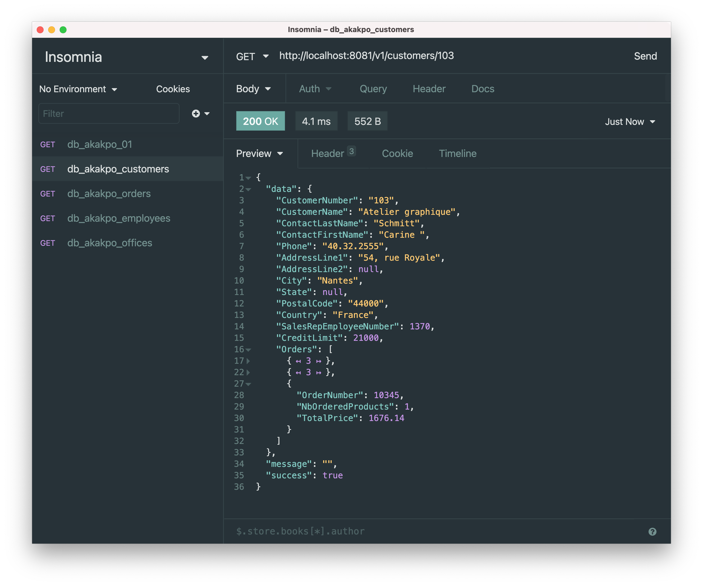
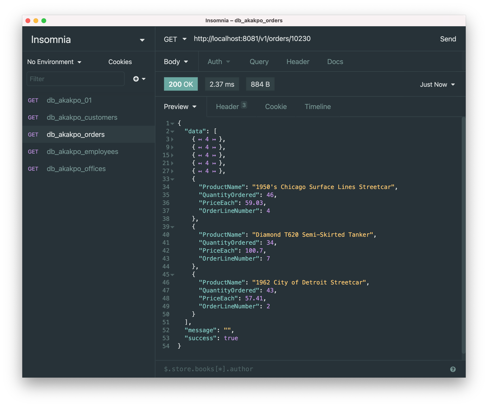
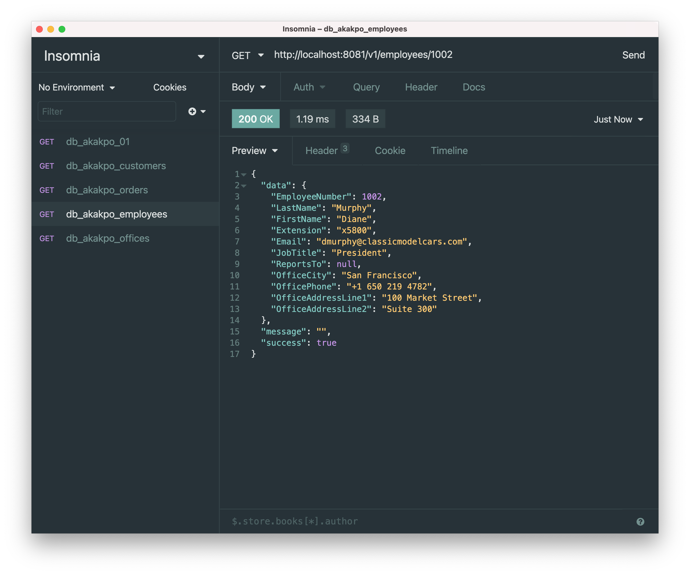
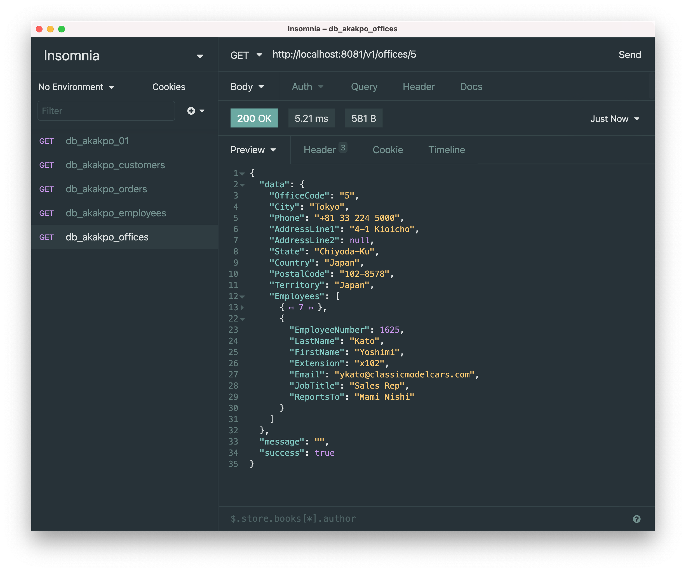

# 🏆 go-classicmodels

This application is an API that could be used to generate a dashboard from a sets of shops data. A shop sells products that can be ordered by customers. A shop has some employees. All theses data has to be processed to output a readable dashboard and later provide statistics for analysis.

## 🌈 Features

- Generate a view of customer, with a recap of their orders



- Generate a view of an order



- Generate a view of an employee



- Generate a view of an office, its employees included



## ✨ Demo available on Heroku

You can test the API deployed on Heroku with this [link](coming-soon).

## 🔥 Setup

The project requires Golang v`1.14.4`. Make sure you have [GoLang](https://golang.org/dl) installed and follow these steps.

### 👨‍💻 Development mode

In development mode, we are using [air](https://github.com/cosmtrek/air) to provide live reload capabilities.

Install the dependencies and start the server with `air`

```sh
git clone https://github.com/HETIC-MT-P2021/DB_AKAKPO_P01 go-classicmodels
cd go-classicmodels
go get
go mod tidy
air
```

### 🚀 Production mode

```sh
git clone https://github.com/HETIC-MT-P2021/DB_AKAKPO_P01 go-classicmodels
cd go-classicmodels
go get
go mod tidy
go build -o main .
./main
```

### 🎮 Technical Choices

Feel free to discuss with any contributor about the technical choices that were made.

Go version : `+1.14.4`

MariaDB : `+10.1`

### 🏄‍♂️ Authors

[Jean-Jacques](https://github.com/gensjaak)
